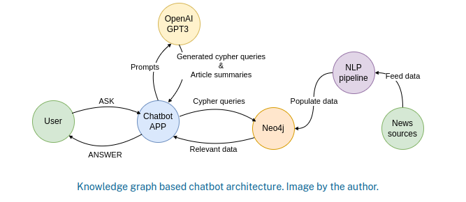
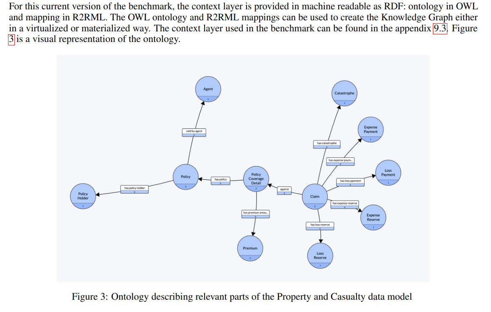
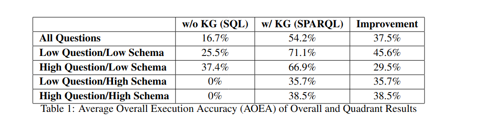
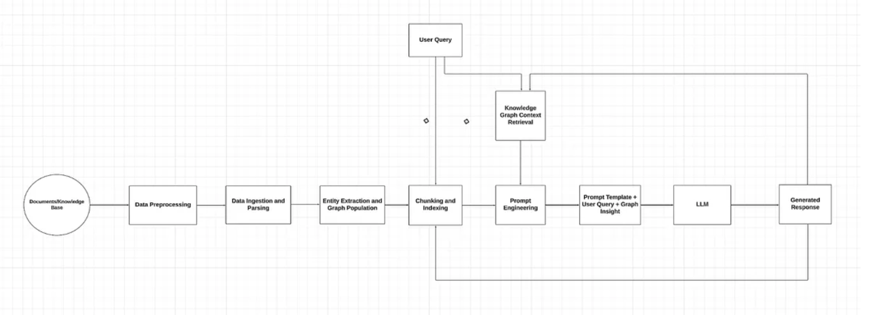
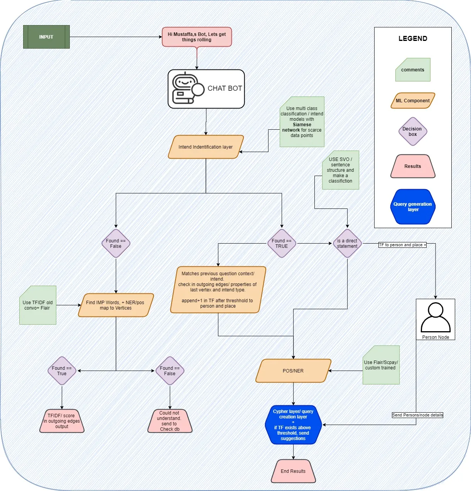

# 1. **Knowledge Graph-Based Chatbot With GPT-3 and Neo4j**  
[🔗 Link to article](https://neo4j.com/blog/developer/knowledge-graph-based-chatbot-with-gpt-3-and-neo4j/)

---

### **Key Findings**
- **Diffbot API** can be used for NLP pipeline testing:
  - Offers **100k free credits**.
  - **Not suitable for production** (paid and expensive).
- **Custom NER Pipeline** for testing:
  - [Tutorial on building a custom NER pipeline with spaCy](https://blog.knowledgator.com/extract-any-named-entities-from-pdf-using-custom-spacy-pipeline-9fd0af2c3e13).

---

---

# 2. **A Benchmark to Understand the Role of Knowledge Graphs on Large Language Model’s Accuracy for Question Answering on Enterprise SQL Databases**

---

- **Alignment**: Closely matches our work.
- **Dataset Used**: Enterprise relational database schema in the insurance domain.  
  [🔗 SQL DDL Link](https://www.omg.org/cgi-bin/doc?dtc/13-04-15.ddl)
- **Application**: Useful during OWL and R2RML phases and benchmarking.

---

### **Key Findings**
1. **Text-to-SQL workbenches**: Spider, WikiSQL, KaggleDBQA.
2. **Knowledge Graphs (KGs)** help bridge business context gaps and reduce hallucinations, enhancing LLM accuracy.
3. **GPT-4 Benchmark**:
   - Without KG: 16.7% accuracy.
   - With KG: **54.2% accuracy** (3× improvement).
   - Settings: `max_tokens=2048`, `n=1`, `temp=0.3`, `timeout=60s`.
   - Insight: Combining KGs with NLP/RAGs substantially boosts performance.

---

---

# 3. **Retrieval-Augmented Generation with Knowledge Graphs for Customer Service Question Answering**

---

- **Dataset Used**: Customer Service queries related to ticketing services.  
  - KG Types:
    - **Intra-issue Tree**
    - **Inter-issue Graph**  
- **Embeddings**: Generated for nodes using models like **BERT** and **E5**, stored in a **vector database** (e.g., Qdrant).

---

### **Key Findings**
1. KGs improve retrieval accuracy and mitigate structural information loss from text segmentation.
2. The method **outperforms baseline** by:
   - **77.6%** in **MRR** (Mean Reciprocal Rank).
   - **+0.32** in **BLEU score**.
3. KGs preserve intrinsic relationships among issues, enhancing retrieval and answer quality.
4. **Real-world Deployment** at LinkedIn:
   - **28.6% reduction** in median issue resolution time.

---

### **Future Scope**
- **Automated Graph Template Extraction**: Eliminate manual template design.
- **Dynamic Graph Updates**: Real-time updates based on user queries.

---

### **Limitations**
1. **Template Dependency**: Manual maintenance required for KG templates.
2. **Static Graph**: KG isn't dynamically updated unless explicitly refreshed.

---

# 4. **KBot: A Knowledge Graph Based ChatBot for Natural Language Understanding Over Linked Data**  
[🔗 Link to paper](https://doi.org/10.1109/ACCESS.2020.3016142)

---

### **Key Findings**
- **KBot** is a chatbot built on **knowledge graphs** using linked data (DBpedia, Wikidata, myPersonality dataset).
- Combines **Natural Language Understanding (NLU)**, **intent classification** (SVM-based), and **SPARQL** query generation.  
  _(In our case we will use Cypher for Neo4j)_
- Supports **analytical queries** over the **myPersonality** dataset (political views, relationship statuses, personality traits).
- **Multilingual capability**: Supports multiple languages using `langdetect`.
- **Flexible Architecture**: Easily extendable to new domains and KBs.
- Achieved higher **precision**, **recall**, and **F1 score** compared to existing linked data chatbots.

---

### **Dataset Used**
- **DBpedia**: Structured knowledge extracted from Wikipedia.
- **Wikidata**: Collaborative open knowledge graph.
- **myPersonality**: Dataset with demographics, personality traits, and community detection data.

---

### **Architecture Overview**
- **Modules**:
  - **NLU**: Speech/text input, language detection, intent classification, entity extraction.
  - **Information Retrieval**:
    - **Keyword Extraction** (Regex + parsers).
    - **SPARQL Query Generation** across multiple KBs.
    - **Analytical Query Handling**.
  - **Knowledge Graph Creation**:
    - Structured response visualization.
  - **Response Selection**:
    - Summarization using **TF-IDF**.
- **Technology Stack**: Flask, Apache Jena, OpenStreetMap integration.

---

### **Results**
- **Intent Classification**: Achieved high accuracy using SVM models.
- **Performance**: Outperformed DBpedia chatbot, Open Data Chatbot, Open Data Assistant.
- **Multilingual Handling**: Successfully supported English and French queries.

---

### **Conclusion**
- KBot successfully integrates semantic web technologies (SPARQL, RDF) with machine learning (SVM) to create a multilingual, multi-KB chatbot.
- It improves linked data interaction through NLU, KG retrieval, and user-friendly knowledge graph displays.

---

### **Future Scope**
- **Expand Text Sources**: Integrate more datasets.
- **Answer Generation**: Incorporate generative models.
- **Third-party Integration**: Slack, Facebook Messenger, Skype.
- **Enhanced Multilinguality**: More language coverage.

---

### **Limitations**
- **SPARQL Dependency**: Requires active endpoints.
- **Manual Intent Training**: Needs updating for new domains.
- **Limited Reasoning**: Primarily retrieval-focused.

---

# 5. **NoSQL Databases: Critical Analysis and Comparison**

---

### **Key Findings**
- **Neo4j** adheres to **ACID** properties despite being a **NoSQL** database.
- **Deployment Options**:
  - Standalone server (via REST interface).
  - Embedded mode within applications.
- **When to Normalize vs Denormalize**:
  - **Normalize** when:
    - Frequent data changes.
    - Strong consistency needed.
    - Frequent write operations.
  - **Denormalize** when:
    - Prioritize fast reads.
    - Data rarely changes.
    - Optimizing query speed and reducing traversal costs.

---

# 6. **Literature Review about Neo4j Graph Database as a Feasible Alternative for Replacing RDBMS**

---

### **Key Findings**

| **Category**               | **Findings**                                                                                   |
|------------------------------|-----------------------------------------------------------------------------------------------|
| **Architecture**             | Neo4j uses a **node–relationship model** based on graph theory. Supports **ACID** transactions. |
| **Performance**              | Faster query responses for **complex, relationship-heavy data** compared to relational DBs.  |
| **Benchmark Results**        | Neo4j outperforms **MySQL** and **PostgreSQL**; **Dex** graph DB outperformed in some cases.   |
| **Limitations in Studies**   | Small sample sizes, lack of real-world datasets, insufficient testing of update/delete ops.    |
| **Hardware/Software Issues** | Test inconsistencies due to varied hardware and OS environments.                              |
| **Data Types**               | Excellent for general queries, but slower performance on numeric types (e.g., **doubles**).   |

---

**Intresting Tutorials that closely align with our system:**
1. [GraphRag using Llamma and Neo4j](https://medium.com/@omotolaniosems/building-an-advanced-rag-chatbot-with-knowledge-graphs-using-llamaindex-neo4j-and-llama-3-1e3d3b07ede3)

 

2. [ GraphRAG App Project using Neo4j, Langchain, GPT-4o, and Streamlit ](https://www.youtube.com/watch?v=odtGLUPXqfs)
- this is using openai api for llm work, can be converted to llama based structure.

3. [Knowledge Graph-based ChatBot](https://medium.com/thecyphy/knowledge-graph-based-chatbot-5416a79d7f17)
- interesting idea of using siamese networks for intend classification and identification of existing intends in the Knowledge Graph in case of less data is available and classes are imbalanced.

4. [GraphRAG: The Marriage of Knowledge Graphs and RAG: Emil Eifrem](https://youtu.be/knDDGYHnnSI?si=Z6FYP-GaOwb4MocX)
- Neo4j's CEO and Co-founder Emil shares his insight on how GraphDB paired with RAGs result in 3x more accurate results. the study that shows it is [link](https://arxiv.org/pdf/2311.07509)

5. [Github repo that collects everything LLM+KG](https://github.com/RManLuo/Awesome-LLM-KG)

6. [Book by Neo4j creaters around KG](https://go.neo4j.com/rs/710-RRC-335/images/developers-guide-how-to-build-knowledge-graph.pdf)

